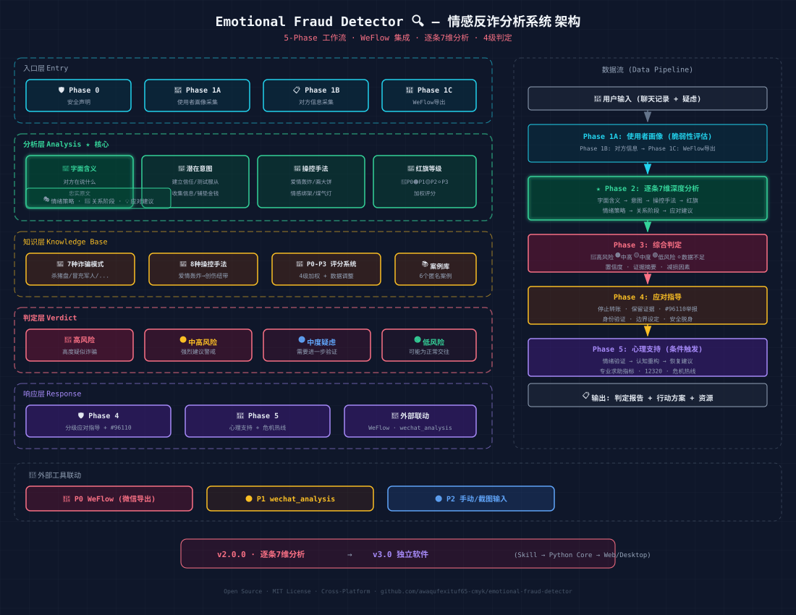

# 情感反诈分析 (Emotional Fraud Detector)

一个为 Claude Code 打造的情感诈骗分析技能.



---

## 这是什么？

这是一个 Claude Code Skill（`.skill` 文件），能够：

- 🔍 **分析聊天记录** — 对照 7 种已知诈骗模式进行匹配
- 🚩 **红旗评分系统** — 4 级加权评分（P0 致命 → P3 低危）
- 🧠 **操控手法识别** — 8 种心理操控手法的检测
- 📋 **四级判定** — 高风险 / 中高风险 / 中度疑虑 / 低风险 / 数据不足
- 🛡️ **分级应对指导** — 按风险等级给出具体行动方案
- 💚 **心理支持** — 高风险判定后自动提供情绪支持和求助资源

---

## 安装

### 一键安装（推荐）

```bash
npx skills add awaqufexituf65-cmyk/emotional-fraud-detector
```

### 手动安装

#### Claude Code

```bash
git clone https://github.com/awaqufexituf65-cmyk/emotional-fraud-detector.git \
  ~/.claude/skills/emotional-fraud-detector
```

#### Codex CLI

```bash
git clone https://github.com/awaqufexituf65-cmyk/emotional-fraud-detector.git \
  ~/.agents/skills/emotional-fraud-detector
```

---

## 使用方式

安装后，在 Claude Code 中直接说：

```
帮我分析这个人的聊天记录，我感觉不太对劲
```

然后粘贴你的聊天记录。Skill 会自动触发，按照 5 阶段流程进行分析。

或者明确触发：

```
/emotional-fraud-detector
```

---

## 工作流程

```
Phase 0 → 安全声明和免责
Phase 1A → 使用者画像采集 (年龄/情感状态/支持系统/脆弱性评估)
Phase 1B → 对方信息采集 (背景/平台/金钱/身份验证)
Phase 2 → 深度分析 (模式匹配 + 操控识别 + 红旗评分 + 时间线 + 反事实)
Phase 3 → 综合判定 (四级判定 + 置信度 + 证据摘要)
Phase 4 → 应对指导 (分级行动方案 + 个性化建议)
Phase 5 → 心理支持 (条件触发，高风险或用户请求)
```

---

## 重要声明

⚠️ **这不是真相判定器**

- 本技能基于模式识别和心理学知识，输出概率性评估
- AI 不能确定一个人的真实意图——它只能告诉你"看起来像什么"
- 如果分析指向诈骗，请向执法机构举报（中国: #96110）
- 如果你正在经历严重的情绪困扰，请寻求专业心理帮助（中国: 12320）
- 本技能不写入文件、不存储数据、不使用网络工具

---

## 文件结构

```
emotional-fraud-detector/
├── SKILL.md                      # 主入口 + 完整工作流
├── references/                   # 知识库 (8个文件)
│   ├── fraud-patterns.md         # 7种诈骗模式目录
│   ├── manipulation-tactics.md   # 8种操控手法分类
│   ├── red-flags-checklist.md    # P0-P3 四级评分
│   ├── communication-guide.md    # 健康沟通指南
│   ├── psychological-support.md  # 心理恢复指南
│   ├── cultural-context.md       # 中国文化背景
│   ├── case-examples.md          # 匿名案例库
│   └── disclaimer-language.md    # 免责声明模板
├── workflows/                    # 5个阶段详细流程
│   ├── phase-1-intake.md
│   ├── phase-2-analysis.md
│   ├── phase-3-verdict.md
│   ├── phase-4-guidance.md
│   └── phase-5-support.md
└── tests/                        # 测试场景和基线对话
    ├── test-scenarios.md
    └── baseline-transcripts/
```

---

## 隐私

- **无数据存储**: 所有分析仅在当前会话中进行
- **无网络调用**: 只使用 Read 和 AskUserQuestion 工具
- **无文件写入**: 不会在本地创建任何文件

---

## 许可证

MIT License

---

## 贡献

欢迎提交 Issue 或 PR。特别欢迎：
- 新发现的诈骗模式
- 中文语境下的操控手法变体
- 心理支持资源的更新

---

## 作者

**EnV** — awaqufexituf65@gmail.com

---

*如果你正在经历诈骗，请拨打 #96110（中国反诈中心）。你值得被保护。*
